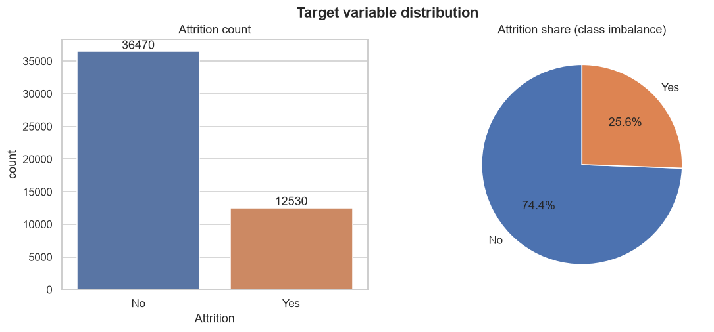
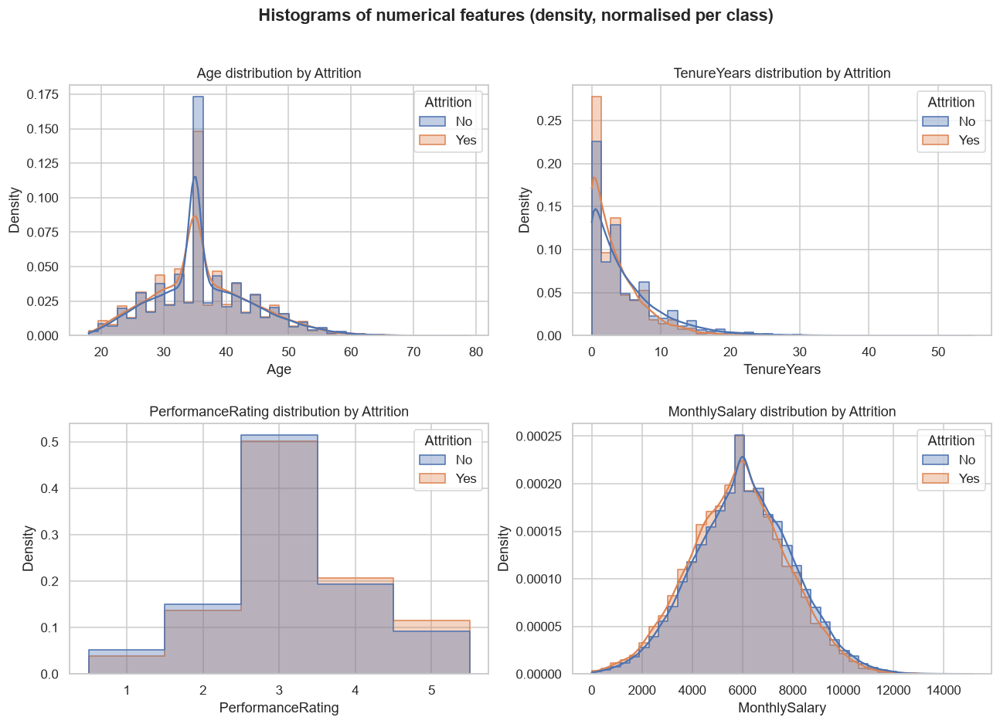
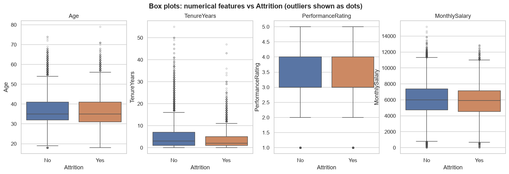
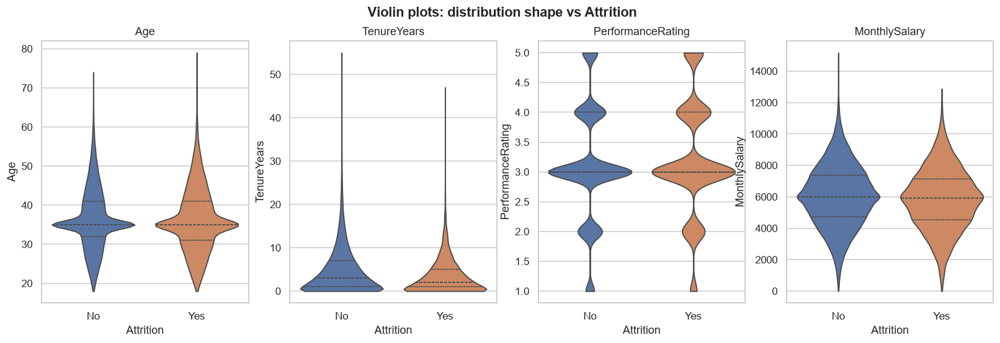
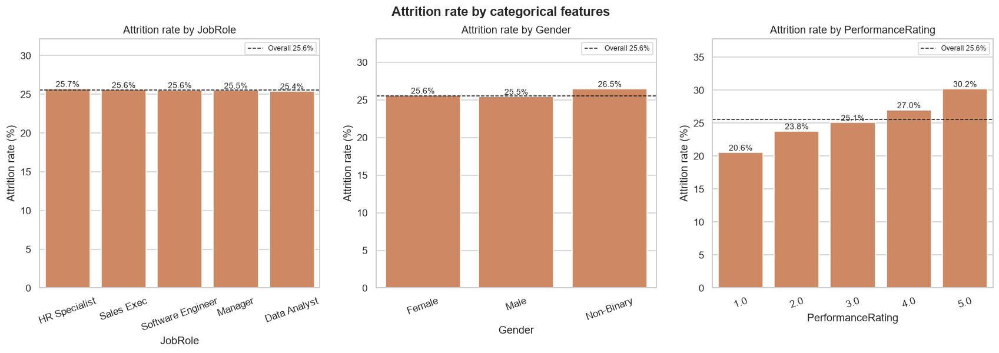
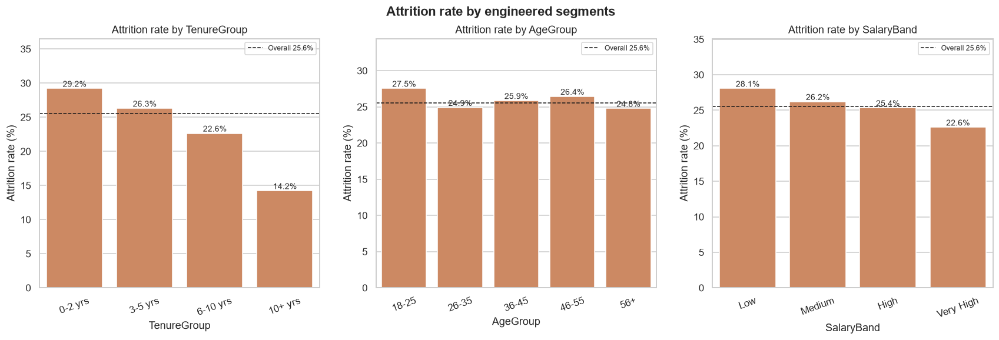
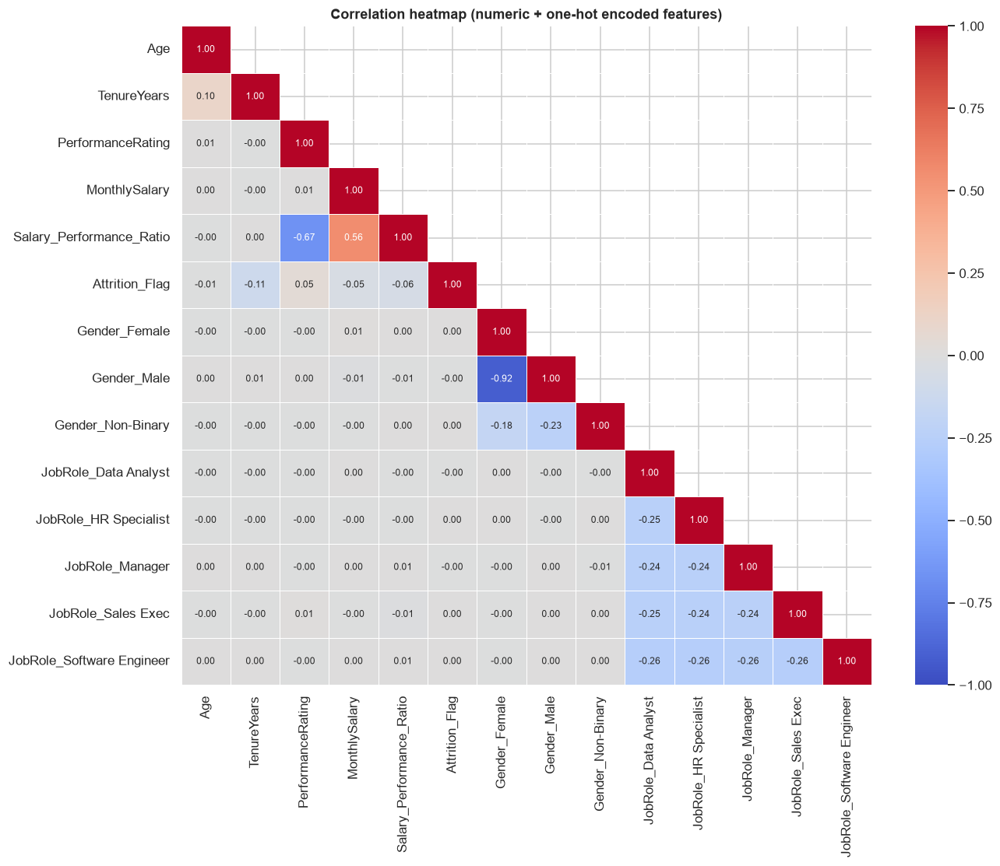
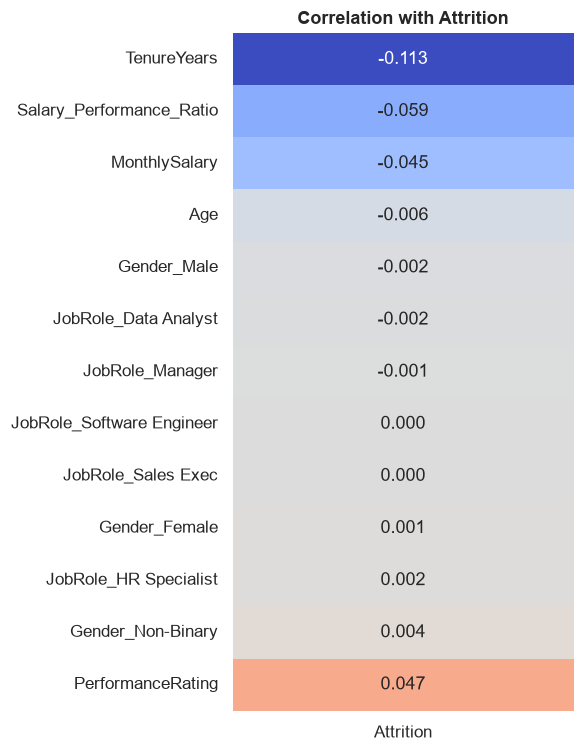
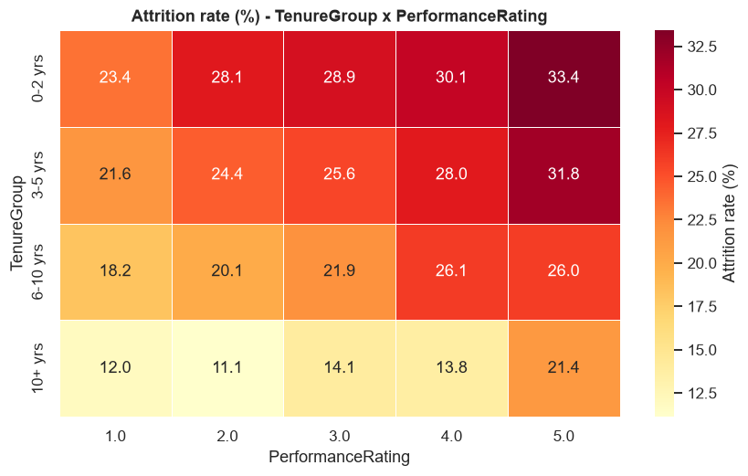
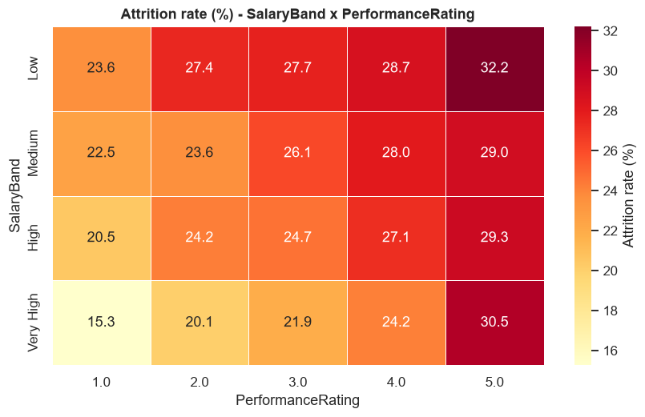

# EDA Report: Employee Attrition Prediction & Analysis
**Milestone 1 · Task 4** | Project NHA-5-153 | Branch `youssef-tasks`

> Sources: every number in this report comes from `src/eda_pipeline.py` (tables in [`tables/`](tables/),
> figures in [`figures/`](figures/)) and is shown in [`notebooks/03_eda_visualization.ipynb`](../notebooks/03_eda_visualization.ipynb).

---

## 1. Executive Summary

- The cleaned dataset has **49,000 employees** with 6 features and the binary target `Attrition`. **25.6 % of employees left**, so the classes are moderately imbalanced.
- **Tenure is the strongest driver of attrition.** New hires (0-2 years) leave at **29.2 %**, about twice the rate of employees with 10+ years (**14.2 %**).
- **High performers leave more.** Attrition rises steadily from **20.6 % (rating 1) to 30.2 % (rating 5)**, and **higher pay does not stop this** (top performers in the highest pay band still leave at 30.5 %).
- **Lower pay is linked to higher attrition**: 28.1 % in the lowest salary quartile vs 22.6 % in the highest.
- **Job role and gender show no relationship with attrition** (χ² p = 0.99 and 0.58).
- Each feature has only a **weak linear relationship** with attrition (|r| ≤ 0.11). Signal comes from combinations such as tenure × performance, which points to **non-linear models and interaction features** in Milestones 2-3.
- A **bug in the Task 2 transformation** (it ran on the raw data, not the cleaned data) was found and fixed on this branch.

---

## 2. Dataset Description

| Feature | Type | Description | Range / Levels |
|---|---|---|---|
| `EmployeeID` | ID | Unique identifier (exclude from modelling) | 1 – 50,000 |
| `Age` | Numeric | Employee age (years) | 18 – 79 |
| `Gender` | Categorical | Male / Female / Non-Binary | 54.4 % / 41.3 % / 4.3 % |
| `JobRole` | Categorical | 5 roles, evenly balanced (about 20 % each) | Software Engineer, Data Analyst, HR Specialist, Sales Exec, Manager |
| `TenureYears` | Numeric | Years at the company | 0 – 55 |
| `PerformanceRating` | Ordinal | 1 (low) – 5 (high) | median 3 |
| `MonthlySalary` | Numeric | Monthly salary | 0.29 – 15,168.70 |
| **`Attrition`** | **Target** | Did the employee leave? | No 36,470 (74.4 %) · Yes 12,530 (25.6 %) |

---

## 3. Data Quality & Cleaning Decisions (Task 1)

Raw file: `raw_employee_attrition_data_(inprogress).csv` (50,000 rows) → cleaned file: `employee_attriton_data_clean.csv` (**49,000 rows**).

| Issue found | Decision | Rationale |
|---|---|---|
| Missing `Attrition` (target) | **Rows dropped** | Target values can't be imputed without biasing the labels |
| Duplicate rows | **Dropped** | Avoid double-counting employees |
| Missing `Age` | Median imputation | Robust to skew |
| `Age` < 18 or > 100 | Set to NaN → median | Invalid working ages |
| `TenureYears` > `Age` | Age set to median (or to tenure if still inconsistent) | Logical consistency |
| Missing `PerformanceRating` | Mode imputation | Ordinal feature |
| `MonthlySalary` = 999999 (placeholder) or negative | Set to NaN → median | Sentinel / impossible values |
| `Gender` "M"/"F" | Standardized to "Male"/"Female" | Consistent categories |
| `JobRole` "software engineer" | Standardized to "Software Engineer" | Consistent casing |

**Validation after cleaning:** 0 missing values, 0 duplicate rows, `EmployeeID` unique, no tenure > age, no negative or placeholder salaries.

### 3.1 Data-quality observations from EDA
| Observation | Evidence | Recommendation |
|---|---|---|
| **Median-imputation spike in Age** | **10,644 rows (21.7 %) have Age = 35** (see the histogram in Fig. 2). Their attrition rate is 22.3 % vs 25.6 % overall, so the rows that were missing Age are not random | Add an `Age_was_missing` flag, or use KNN / group-wise imputation in Milestone 2 |
| Smaller spike in MonthlySalary | 1,032 rows (2.1 %) at the median 5,998.37 | Same as above |
| Implausible tenure | `TenureYears` up to 55; 6.0 % of rows are IQR outliers (> 13.5 yrs) | Cap at a business limit or log-transform for linear models |
| Near-zero salaries | Min 0.29; 0.67 % of salaries are IQR outliers | Check with the data owner; consider capping |

---

## 4. Preprocessing & Feature Engineering Decisions (Task 2)

| Step | Method | Columns |
|---|---|---|
| Normalization | `MinMaxScaler` (0-1) | Age, TenureYears, PerformanceRating, MonthlySalary |
| Encoding | One-hot, `drop_first=True` (avoids the dummy trap; Gender_Male vs Gender_Female r = −0.92) | Gender, JobRole |
| Target encoding | Yes → 1, No → 0 | Attrition |
| Interaction features | product of scaled values | Age×Performance, Tenure×Performance, Salary×Performance |
| **Added on this branch** | Salary-to-performance ratio (scaled), TenureGroup dummies (0-2 / 3-5 / 6-10 / 10+) | from cleaned, unscaled values |

Output: `employee_attrition_transformed.csv` with **49,000 rows × 19 columns**, 0 missing values.

> [!WARNING]
> **Bug fixed:** the original Task 2 cells ran on `df` (the **raw** data) instead of `df_clean`. As a result, the "transformed" data still had NaNs, duplicates, 999999 / negative salaries and rows without a target, and it was never saved. The notebook now works on `df_transformed = df_clean.copy()` and saves the result.

> [!NOTE]
> **Leakage note for Milestone 3:** the scaler is fitted on the full dataset here, which is fine for EDA. For modelling, fit scaling inside an sklearn `Pipeline` on the **training split only**.

---

## 5. Summary Statistics

| Feature | Mean | Std | Min | 25 % | Median | 75 % | Max | Skew |
|---|---|---|---|---|---|---|---|---|
| Age | 36.27 | 7.83 | 18 | 32 | 35 | 41 | 79 | 0.49 |
| TenureYears | 4.52 | 4.98 | 0 | 1 | 3 | 6 | 55 | **2.03** |
| PerformanceRating | 3.15 | 0.95 | 1 | 3 | 3 | 4 | 5 | 0.04 |
| MonthlySalary | 5,999 | 1,958 | 0.29 | 4,676 | 5,998 | 7,311 | 15,169 | 0.04 |

**Stayed vs Left**

| Feature | Mean (Stayed) | Mean (Left) | Median (Stayed) | Median (Left) | Mann-Whitney p |
|---|---|---|---|---|---|
| TenureYears | 4.85 | **3.56** | 3 | **2** | < 0.001 |
| MonthlySalary | 6,051 | **5,848** | 5,999 | 5,901 | < 0.001 |
| PerformanceRating | 3.12 | **3.22** | 3 | 3 | < 0.001 |
| Age | 36.30 | 36.19 | 35 | 35 | 0.078 (n.s.) |

---

## 6. Visual Findings (Task 3)

### 6.1 Target distribution

About a 3 : 1 split between stayers and leavers. A model that always predicts "No" would score 74 % accuracy, so **accuracy is not a suitable metric** for this problem.

### 6.2 Histograms

Leavers are concentrated at low tenure, have slightly lower salaries, and are over-represented at ratings 4-5. The Age distributions overlap almost completely. The spikes at Age 35 and Salary ≈ 6k are imputation artefacts.

### 6.3 Box & violin plots


Tenure for leavers is compressed toward 0-5 years. Stayers have a long upper tail with many outliers above 13.5 years.

### 6.4 Categorical features


| Feature | Attrition range | χ² p-value | Cramér's V | Verdict |
|---|---|---|---|---|
| JobRole | 25.4 % – 25.7 % | 0.993 | 0.002 | No effect |
| Gender | 25.5 % – 26.5 % | 0.577 | 0.005 | No effect |
| PerformanceRating | **20.6 % → 30.2 %** | < 0.001 | 0.048 | Significant, positive |

### 6.5 Engineered segments


| Segment | Levels → attrition % | χ² p | Cramér's V |
|---|---|---|---|
| **TenureGroup** | 0-2: **29.2** · 3-5: 26.3 · 6-10: 22.6 · 10+: **14.2** | < 0.001 | **0.107** (strongest) |
| SalaryBand | Low: **28.1** · Med: 26.2 · High: 25.4 · Very High: **22.6** | < 0.001 | 0.045 |
| AgeGroup | 18-25: 27.5 · 26-35: 24.9 · 36-45: 25.9 · 46-55: 26.4 · 56+: 24.8 | 0.002 | 0.019 (negligible) |

45 % of the workforce is in the 0-2-year group, so the highest-risk segment is also the largest.

### 6.6 Correlation heatmaps



Correlation with Attrition: **TenureYears −0.113**, Salary/Performance ratio −0.059, PerformanceRating +0.047, MonthlySalary −0.045, Age −0.007, all JobRole/Gender dummies about 0.
The original features are almost independent of each other (|r| ≤ 0.10), so there is **no multicollinearity** among them.

### 6.7 Two-way attrition-rate heatmaps



- **Tenure × Performance:** the risks add up. New hires with rating 5 reach **33.4 %**, while long-tenured employees with rating 1-2 sit at **11-12 %**.
- **Salary × Performance:** pay has a large effect on low performers (rating 1: 23.6 % at Low pay → 15.3 % at Very High pay) but **almost none on top performers** (rating 5: 32.2 % → 30.5 %).
- JobRole × Tenure and JobRole × Salary heatmaps (`figures/09_*`, `figures/10_*`) show the same gradients in every role.

### 6.8 Interactive charts
Open the Plotly files in [`interactive/`](interactive/) in a browser: salary-vs-tenure scatter by role, a role × tenure sunburst, salary box plots, and an age histogram.

---

## 7. Key Patterns & Business Interpretation

| # | Pattern | Business meaning | HR action |
|---|---|---|---|
| 1 | **Early-tenure attrition** (29 % in years 0-2) | Onboarding and early engagement are the main weak points | Structured onboarding, mentoring, 6/12/18-month check-ins |
| 2 | **Top performers leave more** (30 % at rating 5) | Loss of high-value talent ("flight of talent") | Career paths, promotion visibility, recognition programmes |
| 3 | **Pay doesn't keep top performers** | Salary competitiveness isn't the main reason top performers leave | Non-monetary levers: challenging work, growth, autonomy |
| 4 | **Low pay increases attrition** in the general population | Pay competitiveness matters for average and low performers | Benchmark salaries in the lowest quartile |
| 5 | **Role/gender neutral** | Attrition isn't concentrated in any department or demographic | Company-wide retention policy rather than role-specific fixes |

---

## 8. Limitations

- **Narrow feature set:** there are no Department, Overtime, WorkLifeBalance, JobSatisfaction, Promotion or Distance features, which are often the strongest predictors in attrition studies. The project brief lists work-life balance, which this dataset doesn't contain.
- **Weak single-feature signal** (max |r| = 0.11) means expected model performance is modest. Gains will need to come from interactions and non-linear models.
- **Imputation artefacts:** 21.7 % of `Age` values are imputed medians, which hides their real distribution.
- The data appears **synthetic** (perfectly balanced roles, near-normal salary), so generalising to a real organisation needs validation.
- The data is cross-sectional with **no time dimension**, so "attrition trends over time" (Milestone 2 dashboards) can't be computed directly.

---

## 9. Recommendations for Milestones 2 & 3

1. **Feature selection:** keep TenureYears / TenureGroup, PerformanceRating, MonthlySalary / SalaryBand, and Salary_to_Performance_Ratio. Test dropping JobRole and Gender (no signal, and dropping Gender also helps fairness).
2. **New features:** Tenure × Performance interaction (strongest two-way pattern), `Age_was_missing` flag, `HighPerformer_NewHire` flag (tenure ≤ 2 and rating ≥ 4).
3. **Statistical tests:** formalise the χ² / Mann-Whitney results here with t-tests / ANOVA and RFE (Milestone 2, Task 1).
4. **Outliers:** cap `TenureYears` (e.g. at the 99th percentile) and check near-zero salaries.
5. **Modelling:** stratified train/test split; handle imbalance with SMOTE or `class_weight="balanced"`; evaluate with **Recall, F1, ROC-AUC, PR-AUC**; prefer tree ensembles (RF, XGBoost) because of the weak linear signal; fit the scaler inside a `Pipeline` to avoid leakage.

---

## Appendix: Reproducibility

```bash
pip install -r requirements.txt
python src/eda_pipeline.py        # regenerates reports/figures, reports/tables, reports/interactive
```

| Table | Content |
|---|---|
| `tables/summary_statistics.csv` | Descriptive stats + skew / kurtosis |
| `tables/numeric_by_attrition.csv` | Mean / median / std by class |
| `tables/attrition_rate_by_segment.csv` | Attrition % for every category / segment |
| `tables/statistical_tests.csv` | Mann-Whitney, χ², point-biserial r, Cramér's V |
| `tables/correlation_with_attrition.csv` | Pearson r with target |
| `tables/outliers_iqr.csv` | IQR fences & outlier counts |
| `tables/imputation_spikes.csv` | Imputation artefact check |
